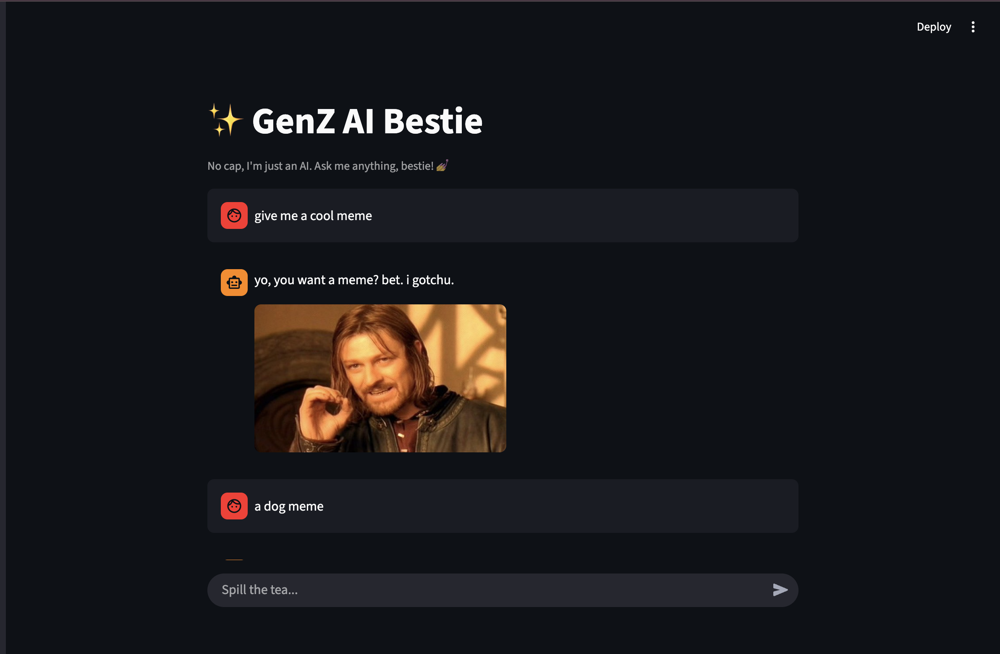

# ✨ GenZ AI Bestie: Persona-Based Agent with Tool Calling

[](https://genz-chatbot-live-k77gftl6ldfykthwugadvm.streamlit.app/)



A conversational AI agent that breaks the "robotic assistant" mold. This project demonstrates **System Prompt Engineering**, **Context Retention**, and **Agentic Tool Use** (Meme Generation) to create a distinct, engaging user persona.

👉 **[Live Demo: Chat with the Bestie](https://genz-chatbot-live-k77gftl6ldfykthwugadvm.streamlit.app/)**

---

## 🚀 Key Features

* **🎭 Enforced Persona (System Prompting):** Uses a strict system instruction to maintain a "Gen Z" linguistic style (slang, lowercase text, emojis) without breaking character, effectively solving the "boring AI" problem.
* **🛠️ Agentic Tool Use (Meme Generator):** The model is instructed to recognize when a user wants a visual reaction. It outputs a specific token (`[SEND_MEME]`), which the Python backend intercepts to trigger a function that displays a relevant image.
* **🧠 Context Retention:** Maintains conversation history in `st.session_state` so the agent remembers previous turns.
* **🔒 Secure Deployment:** API keys are managed via Streamlit Secrets, ensuring no credentials are leaked in the code.

## 🛠️ Tech Stack

* **Frontend:** [Streamlit](https://streamlit.io/) (Python-based UI)
* **LLM Engine:** Google Gemini 2.5 Flash (via `google-generativeai`)
* **Hosting:** Streamlit Cloud

## 📂 Project Structure

```bash
GenZ-Chatbot-Live/
├── app.py                # Main application logic & System Prompt
├── requirements.txt      # Dependencies
└── README.md             # Documentation
Clone the repository:

Bash

git clone [https://github.com/Swastika3647/GenZ-Chatbot-Live.git](https://github.com/Swastika3647/GenZ-Chatbot-Live.git)
cd GenZ-Chatbot-Live
Install dependencies:

Bash

pip install -r requirements.txt
Set up your API Key:

Get a key from Google AI Studio.

Create a .streamlit/secrets.toml file (for local runs) OR simply enter it in the sidebar when the app runs.

Run the app:

Bash

streamlit run app.py
